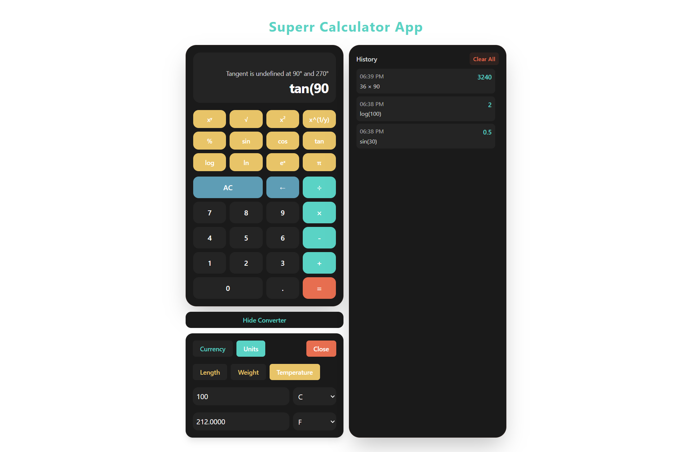
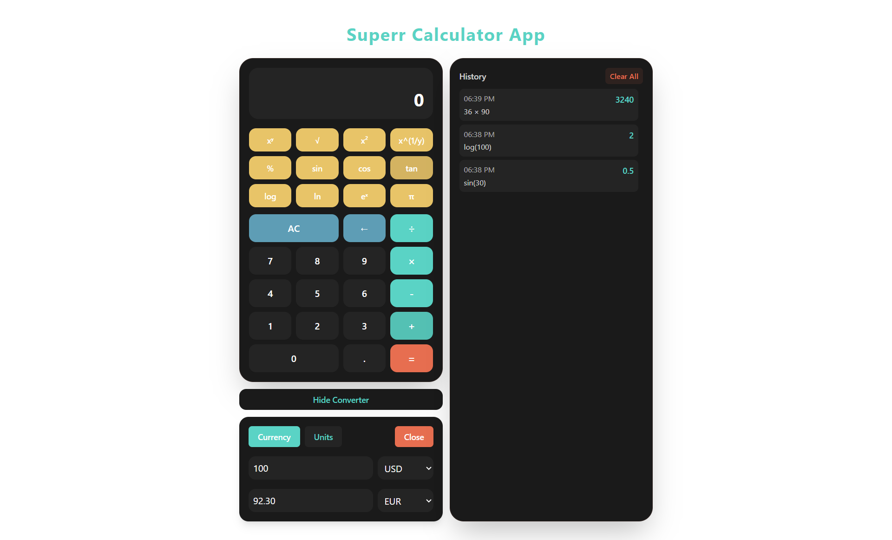

# Super Calculator

A modern, feature-rich calculator web application built with React and Vite, offering both basic arithmetic operations and advanced mathematical functions, along with unit and currency conversion capabilities.

  
  

## Features

### Core Calculator Functions

- **Basic Operations**

  - Addition, subtraction, multiplication, division
  - Percentage calculations
  - Clear and backspace functionality

- **Advanced Mathematical Functions**
  - Square root (√)
  - Exponentiation (x^y)
  - nth root calculations (x^(1/y))
  - Trigonometric functions (sin, cos, tan)
  - Logarithmic functions (log, ln)
  - Constants (π)

### Converter Tools

- **Currency Converter**

  - Real-time exchange rates
  - Support for major currencies (USD, EUR, GBP, JPY, CNY, INR)
  - Automatic rate updates

- **Unit Converter**
  - Length (meters ↔ feet, kilometers ↔ miles, etc.)
  - Weight (kg ↔ lbs, g ↔ oz, etc.)
  - Temperature (°C ↔ °F ↔ K)

### Additional Features

- **Calculation History**
  - Track previous calculations
  - Click to reuse past results
  - Clear history option
- **Responsive Design**
  - Mobile-friendly interface
  - Adaptive layout for different screen sizes
  - Touch-optimized buttons

## Tech Stack

- **Frontend Framework**: React with Vite
- **Styling**: Tailwind CSS
- **UI Components**: shadcn/ui

### Basic Operations

- Use the numeric keypad for number input
- Click operation buttons (+, -, ×, ÷) for basic arithmetic
- Press '=' or Enter key to calculate results
- Use 'AC' to clear all and '←' for backspace

### Advanced Functions

- Access advanced operations from the top section
- Use x^y for exponents
- Use x^(1/y) for nth roots
- Trigonometric functions work in degrees

### Converter Tools

1. Click "Show Converter" to access conversion tools
2. Choose between Currency or Unit conversion
3. Select your desired units/currencies
4. Enter the value to convert
5. See real-time conversion results
